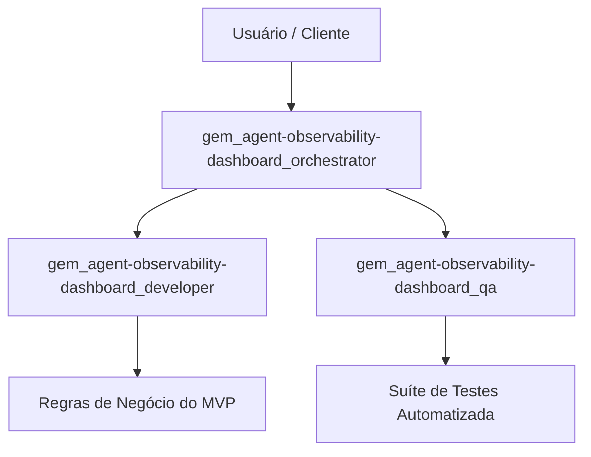

# Arquitetura do Produto: Agent Observability Dashboard

```mermaid
graph TD
    Client[Usuário / Cliente] --> Orch[gem_agent-observability-dashboard_orchestrator]
    Orch --> Dev[gem_agent-observability-dashboard_developer]
    Orch --> QA[gem_agent-observability-dashboard_qa]
    Dev --> Domain[Regras de Negócio do MVP]
    QA --> Tests[Suíte de Testes Automatizada]
```
