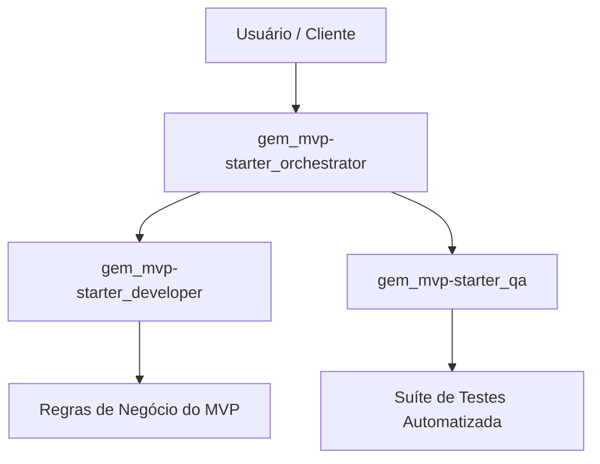

# Arquitetura do Produto: Mvp Starter

```mermaid
graph TD
    Client[Usuário / Cliente] --> Orch[gem_mvp-starter_orchestrator]
    Orch --> Dev[gem_mvp-starter_developer]
    Orch --> QA[gem_mvp-starter_qa]
    Dev --> Domain[Regras de Negócio do MVP]
    QA --> Tests[Suíte de Testes Automatizada]
```
